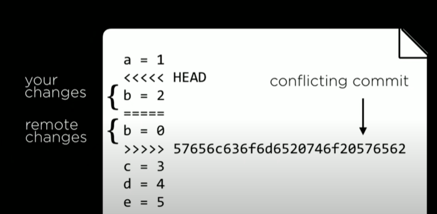

## Git
- Ability to go back to older versions
- Way to create a new branch, experiment changes, merge if succesful

### Useful Commands

- `git clone <url>`
  - Download a git repo from the internet to system
  
- `git add <filename>`
  - Keep track of this file
  
- `git commit -m "message"`
  - Save the changes to the added files, and mark the changes using suitable message
  - The changes are saved in the local repo

  - `git commit -am "message"` to combine add and commit, when all the files need to be added

- `git status`
  - Compare the repo at server vs local

- `git push`
  - Push the changes from local to repo

- `git pull`
  - Pull the latest version of the code from repo

- `git log`
  - See the details of all past commits

- `git reset`
  - Go back to previous state of the repo
  - Eg. `git reset --hard <commit>`, goes back to the commit given by hash
  - Eg. `git reset --hard origin/master`, goes to the repo on server, discarding local changes
  
  
### Merge Conflicts

- Changes in my local repo and server repo conflict with each other (eg. different changes to same line), when `git pull` is called

- Manual resolution is needed

### Branching

- Some applications require a graph structure, and linear structure is not as useful, so branches are helpful
- _HEAD_ is a pointer to the branch we are working on, _master_ is the main branch
- perform _merge_ is the feature was succesful

- `git branch` : current branch
- `git checkout -b <branch>` : create a new branch, and switch to it
- `git checkout <branch>`: switch to an old branch
- `git merge <branch>`: merge changes from "branch" to current branch

### GitHub Features
- **Fork**: make our own copy of existing repo
- **Pull Request**: request the owners to merge changes from you
- **GitHub Pages**: a free static website
  - Name the repo as repo.io
  - add `index.html`
  - Website is ready!